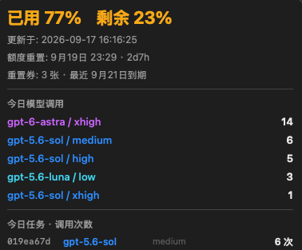

# Codex Quota Bar

在 macOS 菜单栏显示 Codex 剩余额度、重置倒计时和当天模型调用汇总。

Codex Quota Bar is an unofficial macOS menu bar utility for viewing remaining Codex quota and local daily model activity.

## 界面预览

<p align="center">
  
</p>

<p align="center">
  
</p>

> [!IMPORTANT]
> 这是非官方社区项目，与 OpenAI 没有关联或背书。Codex 和 OpenAI 是其各自权利人的商标。

## 功能

- 菜单栏显示剩余额度和距离重置的时间，例如 `26% 2d8h`。
- 不足一天时显示到分钟，例如 `5h30m`。
- 展示额度更新时间、重置时间、重置券数量及最近到期日。
- 汇总当天使用的模型、推理等级和调用次数。
- 按任务展示对应模型、推理等级和调用次数；子代理在同一列表中显示名称和所属父任务。
- 可选的本地上游观察模式，分别显示请求模型与上游响应声明的模型。
- 提供常驻监控窗口；最新记录优先显示，翻看旧记录时不会被自动拉回顶部。
- 上游观察元数据持续保存为本地 JSONL，可在访达中显示或从应用内清空。
- 一键设置本地转发，一键恢复原始 Codex 配置；正常退出时自动恢复。
- 启动时查询额度，之后每 5 分钟自动更新；也可手动刷新。
- 原生 Swift + AppKit，无 Electron、无第三方运行时依赖。

## 访问逻辑与隐私

### 实时额度

应用会查找本机已经安装的官方 `codex` 命令行程序，然后短暂启动：

```text
codex app-server --stdio
```

通过本地 JSON-RPC 调用 `account/rateLimits/read` 获取：

- 已用百分比和剩余百分比；
- 额度重置时间；
- 重置券数量和最近到期时间。

这次调用会由 Codex CLI 使用现有 ChatGPT 登录状态访问 OpenAI，因此会产生一条很小的网络请求，但不会启动模型任务，也不会消耗 Codex 对话额度。Codex Quota Bar 不读取、不复制、不保存登录 token。

查询发生在启动时、每 5 分钟以及点击“刷新”时。查询失败会继续展示上一次成功结果并标记为旧数据，不会连续重试。

### 本地模型统计

当天模型和任务汇总只读访问以下本机数据库：

```text
~/.codex/logs_2.sqlite
~/.codex/state_5.sqlite
~/.codex/thread_history_1.sqlite
```

读取通过系统自带的 `/usr/bin/sqlite3 -readonly` 完成，不修改数据库。应用不上传任务标题、模型统计或 SQLite 内容。
子代理名称及所属父任务来自 `state_5.sqlite` 中的 `agent_path`、`parent_thread_id` 和任务名称；应用不读取加密的代理通信正文。

### 可选的上游模型观察

点击“开启监测”后，应用会先在本机 `127.0.0.1:43187` 启动转发器，再为 `~/.codex/config.toml` 设置官方支持的 `openai_base_url`。Codex 的 `/models`、Responses API 和 WebSocket 请求仍然只转发到 `chatgpt.com/backend-api/codex`。

**当前状态：本地转发、请求/响应元数据采集和持久化已实际工作；模型判定的有效性仍存疑。**界面中的“上游模型”只表示响应里可见的 `response.model`、模型响应头或重路由事件，并不能独立证明实际执行推理的底层模型。上游字段是否始终存在、是否与真实执行模型一致，尚未得到官方保证；请把差异告警当作观察线索，而非确定结论。

设置前的配置会原样备份到：

```text
~/Library/Application Support/CodexQuotaBar/config-before-relay.toml
```

备份仅保存在本机并限制为当前用户读取。若原配置含有自定义 API 密钥等敏感字段，备份也会包含它们；请勿分享备份文件。恢复配置后会删除该备份。

点击“恢复配置”会原样写回备份。正常退出 Codex Quota Bar 时也会先恢复配置，再停止本地转发器；应用意外退出后，重新打开即可恢复监听并使用“恢复配置”。

转发器只提取并保存以下元数据：

- 请求模型与推理等级；
- Responses API 返回的 `response.model`；
- 上游明确返回时的 `openai-model`、`x-openai-model` 或模型重路由事件。

观察记录保存在 `~/Library/Application Support/CodexQuotaBar/relay-observations.jsonl`。应用不保存认证头、Cookie、提示词、回答正文或完整网络帧。`response.model` 是上游响应声明，不等同于对底层物理执行模型的独立证明。

菜单弹窗显示当天最近的记录；点击底部“监控窗口”可打开不会因点击外部而关闭的常驻窗口，查看本地文件中最近 500 条记录。完整记录不受这个界面数量限制，仍保留在上述 JSONL 文件中。监控窗口提供“在访达中显示”和“清空记录”，清空前会要求确认。

[Codex 官方配置参考](https://learn.chatgpt.com/docs/config-file/config-reference#configtoml)和[自定义模型提供商文档](https://learn.chatgpt.com/docs/config-file/config-advanced#custom-model-providers)提供了 `openai_base_url`、自定义代理、OpenAI 认证与 WebSocket provider 选项。本项目使用本机透明转发，不提供第三方中转服务，也不尝试绕过账户额度或模型路由。

### 不会做的事

- 不调用模型生成内容；
- 不读取或保存 Codex 登录态凭证；启用转发时对 `config.toml` 的本地完整备份如上所述；
- 不修改 `~/.codex` 数据库；
- 未开启上游观察时不修改 `~/.codex/config.toml`；
- 不包含遥测、广告或第三方分析；
- 不向 OpenAI 以外的服务发送请求。

`account/rateLimits/read` 属于 Codex app-server 协议，未来 Codex 版本可能调整该协议。如果实时查询失效，请提交 issue 并附上 Codex 版本和错误现象，不要上传凭证或数据库文件。

## 系统要求

- macOS 14 或更高版本；
- 已安装并登录 Codex/ChatGPT Desktop，或安装了兼容的 Codex CLI；
- Apple Silicon Mac。源码可在其他架构的 Mac 上自行编译。

应用会按顺序查找常见的 Codex CLI 路径，包括 ChatGPT/Codex Desktop、`~/.local/bin`、Homebrew 和 `/usr/local/bin`。

## 从源码构建

```bash
git clone https://github.com/IsaacSu95/codex-quota-bar.git
cd codex-quota-bar
./package_share.sh
```

构建产物：

```text
dist-share/CodexQuotaBar.app
dist-share/CodexQuotaBar.zip
```

## 安装

从 [Releases](https://github.com/IsaacSu95/codex-quota-bar/releases/latest) 下载 `CodexQuotaBar.zip`，解压后将 `CodexQuotaBar.app` 拖入系统 `/Applications` 文件夹并运行。

当前构建使用 ad-hoc 签名，没有 Apple Developer ID 公证。如果 macOS 阻止首次打开：

1. 在访达中右键应用并选择“打开”；
2. 再次确认打开；
3. 或在“系统设置 → 隐私与安全性”中允许本次启动。

源码安装到当前用户目录：

```bash
./install_to_applications.sh
```

该脚本安装到 `~/Applications/CodexQuotaBar.app`，聚焦搜索可以找到它；访达侧边栏的“应用程序”通常对应系统 `/Applications`。

## 命令行诊断

只读取本地模型和任务统计：

```bash
dist-share/CodexQuotaBar.app/Contents/MacOS/CodexMeter --once
```

执行一次实时额度查询：

```bash
dist-share/CodexQuotaBar.app/Contents/MacOS/CodexMeter --fetch-usage
```

只启动本地转发器进行诊断，不修改 Codex 配置：

```bash
dist-share/CodexQuotaBar.app/Contents/MacOS/CodexMeter --relay-only
```

额度诊断输出只包含额度、重置时间和重置券信息；转发诊断只输出监听状态。两者都不输出账号 ID 或凭证。

## AI 协作声明

本项目由 [IsaacSu95](https://github.com/IsaacSu95) 以个人名义提出需求、确定交互并进行验收，主要代码与文档通过 OpenAI Codex 协作生成和迭代。

AI 生成不代表代码天然正确或安全。项目保留了简洁实现并进行了编译、额度查询和打包验证，但使用者仍应自行审查源码，尤其是在 Codex app-server 协议或本地数据库结构发生变化后。

## License

[MIT](LICENSE)
